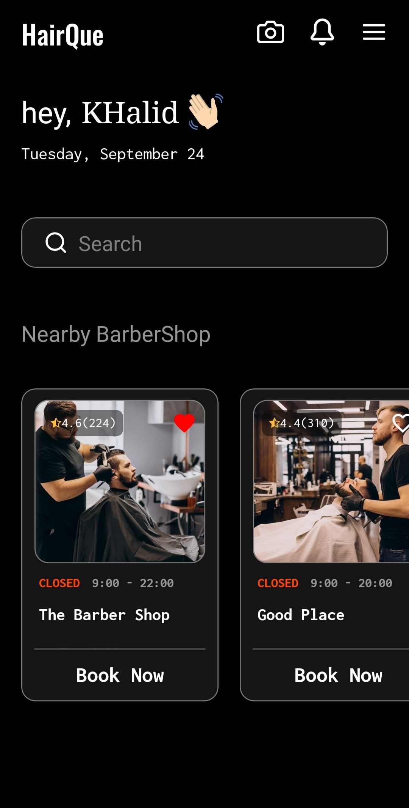
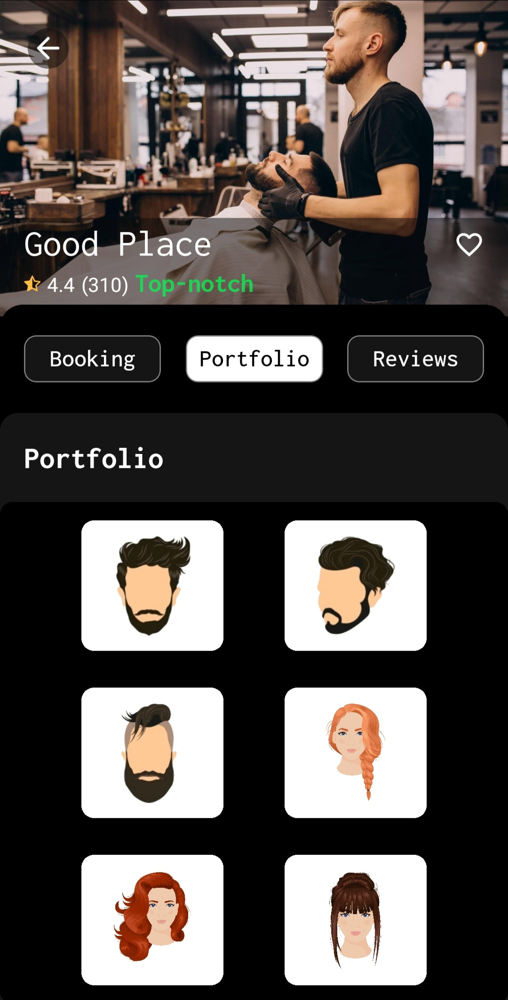
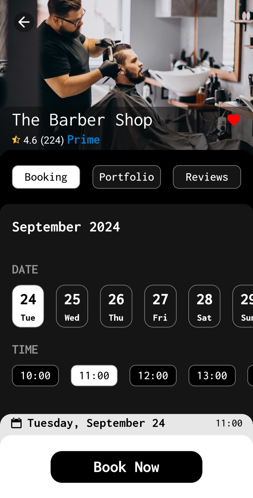
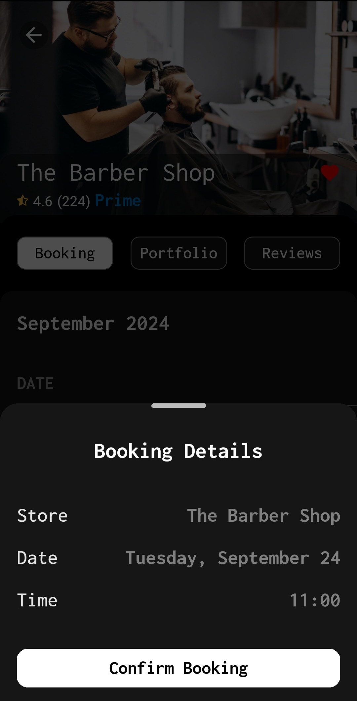
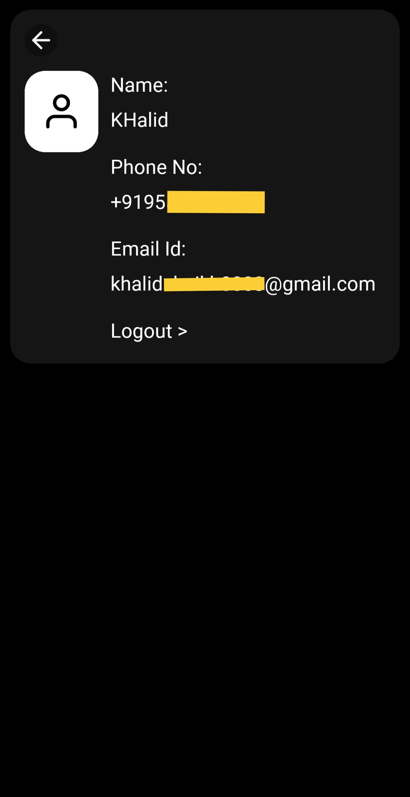
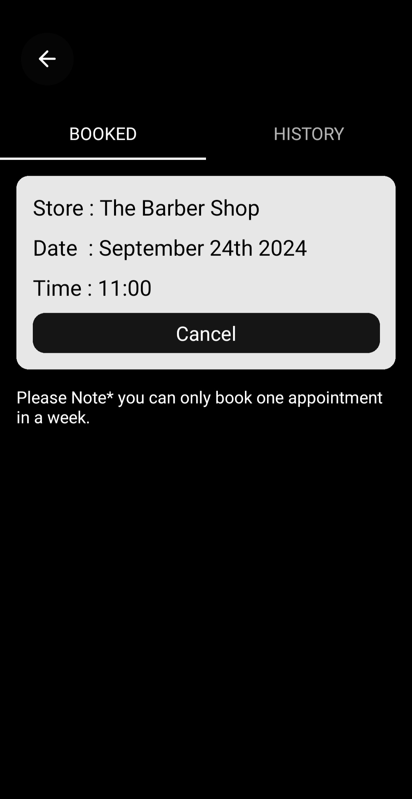

# HairQue - Haircut Appointment Booking App

HairQue is a convenient appointment booking app designed for salons, beauty parlors, and haircut studios. It allows users to browse through registered stores, check their portfolios, and book appointments for a specific date and time slot. The app is user-friendly and ensures a smooth booking experience with notification confirmations and a personalized user profile.

## Key Features
- **Store Listings**: All registered stores are listed on the homepage for users to explore.
- **Portfolio Preview**: Each store showcases its work, allowing new users to judge and select a store for their appointment.
- **Appointment Booking**: Users can choose from available dates and hourly time slots for booking their haircut or beauty services.
- **Booking Confirmation**: Users receive notifications showing the confirmation of their booking.
- **Current & Previous Bookings**: All confirmed bookings are visible to the user for reference.
- **User Profile**: Users can manage and view their profile information.

## Demo

### Home Page (Store Listings)


### Store Portfolio


### Booking Tab


### Booking Confirmation


### User Profile


### Booking History


## Tech Stack
- **Frontend**: React Native
- **Backend**: Node.js, Express.js
- **Database**: MongoDB
- **Notifications**: Firebase Notifications

## How to Use
1. Clone this repository:  
    ```bash
    git clone https://github.com/username/HairQue.git
    ```
2. Install the necessary dependencies:  
    ```bash
    cd HairQue  
    npm install
    ```
3. Start the development server:  
    ```bash
    npm start
    ```

## Project Structure
```
├── src
│   ├── components
|   |   |__ Authentication
|   |   |__ Home
│   │   ├── Important_files
│   │   ├── ShopDetails
│   ├── assets/
│   │   ├── fonts/
│   │   ├── colors/
│   │   │   └── colors.js
├── README.md
└── package.json
```

## Contribution Guidelines
We welcome contributions to enhance the HairQue experience. Please follow the steps below to contribute:

1. Fork the repository.
2. Create a new branch for your feature or bug fix.
3. Commit your changes and push them to your forked repository.
4. Open a pull request and provide a detailed description of your changes.

## License
This project is licensed under the MIT License. See the [LICENSE](LICENSE) file for more information.
